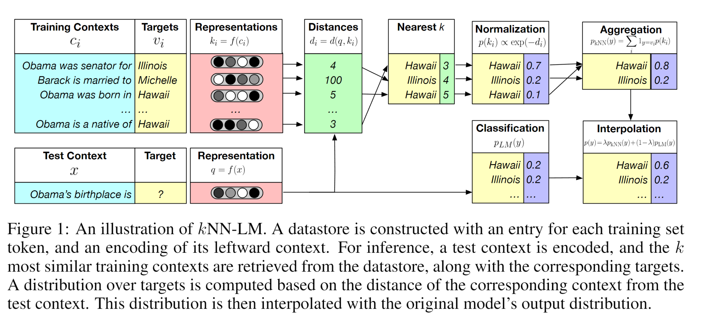
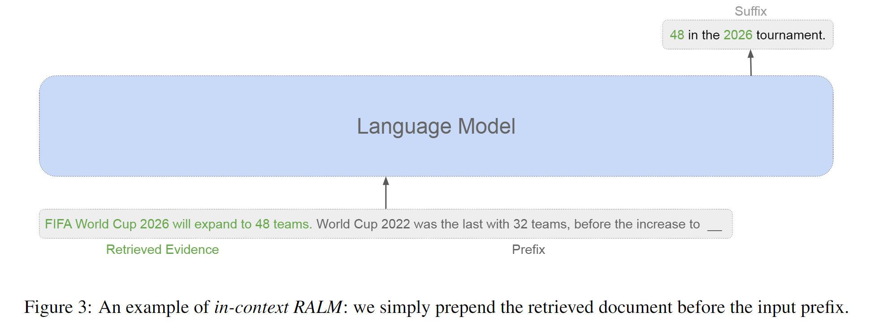
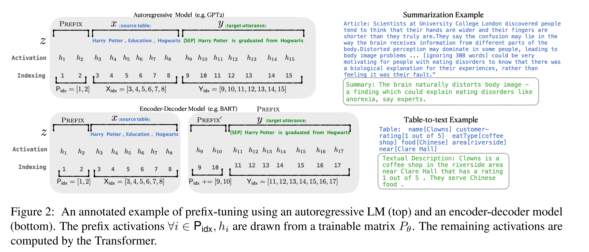
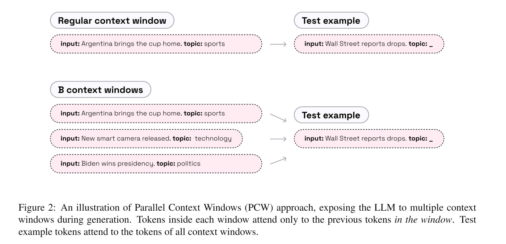
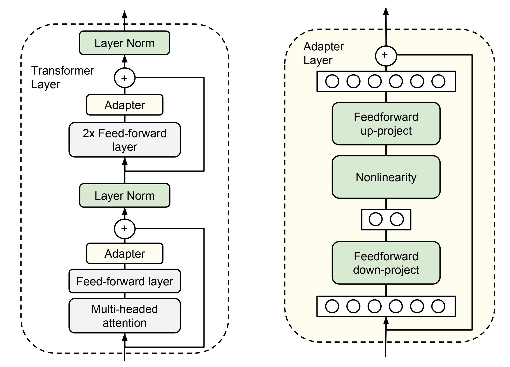
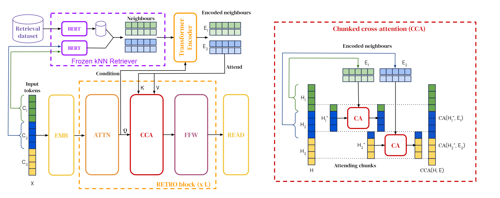
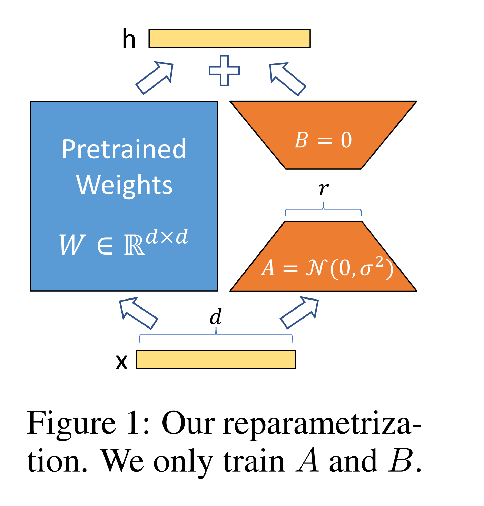

出发点：ChatGPT出现后，如RAG、Realm的检索增强的方式不能简单迁移到大模型上去，因此我们决定探索检索这种方式如何增强大语言模型，我们着重研究如何将检索到的文档融入大语言模型中，是需要重新训练语言模型（如Retro）还是可以在已有的LM上进行SFT，又或者只用优化语言模型的输入？

# 目前几种LLM利用检索文本的方式
关键词：retrieval reader model, knowledge injection

1. Retro：为decoder-only LLM加几层Chunk Cross Attention，然后训练
    - Retro官方：
    - Nvidia团队

2. In-Context：将检索到的文档放在输入中
    - PCW：将检索到的N篇文档与剩余输入，并行的输入LLM中。主要是位置编码和注意力机制上的改变
    - 不同的选择文档的方式
        - 根据剩余长度选择一个或多个文档
        - 直接给最好的文档（人工选择）
        - 检索器给出最好的
            - 根据输入
        - 重排序
            - 输入的前半部分预测后半部分
            - 使用模型总结 2w token-> 2k token
        - Prefix，输入的是文档的表示

3. K Nearest Neighbor：语言模型得到一个token分布概率，从最近的K个邻居处也得到一个概率

4. Lora：只训练模型某几层的旁路，从而让模型具备利用文档的能力

5. Adapters：为模型额外加几层layer作为适配器。

|  名称     | 简介 |   对LLM权重的修改     |    图片    |  实现 or 对比
|-|-|-|-|-|
| KNN-LM     |检索文档得到下一个token的概率分布，与LLM得到的概率分布相加 | 无  | | 对比
| In-Context|将检索到的文档直接拼接到LLM的输入中，这里检索方式由很多种 | 无  |  |对比
| Prefix    | 将检索到的文档以embedding的方式输入LLM，而非token id |无| | 对比
| PCW       | 通过设计调整注意力机制和位置编码拓展LLM最大输入长度|无？ | |实现
| Adapters  | 在LLM额外加几层Layer|额外模块     |  | 对比
| Retro     | Chunk Cross Attention机制将检索到的文档注入LLM中|重新训练/SFT || 对比
| Lora      | 在语言模型某几层旁边添加一个旁路 |额外模块 ||实现

In-Context:
1. In-Context Retrieval-Augmented Language Models；BM25选Top1、或者在Top25中选最好的、使用LM来进行Ranker
2. Standing on the Shoulders of Giant Frozen Language Models；进行总结，2w token-> 2k token
····
