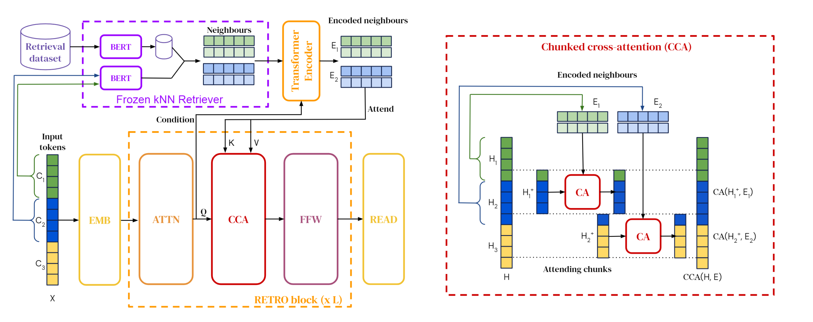
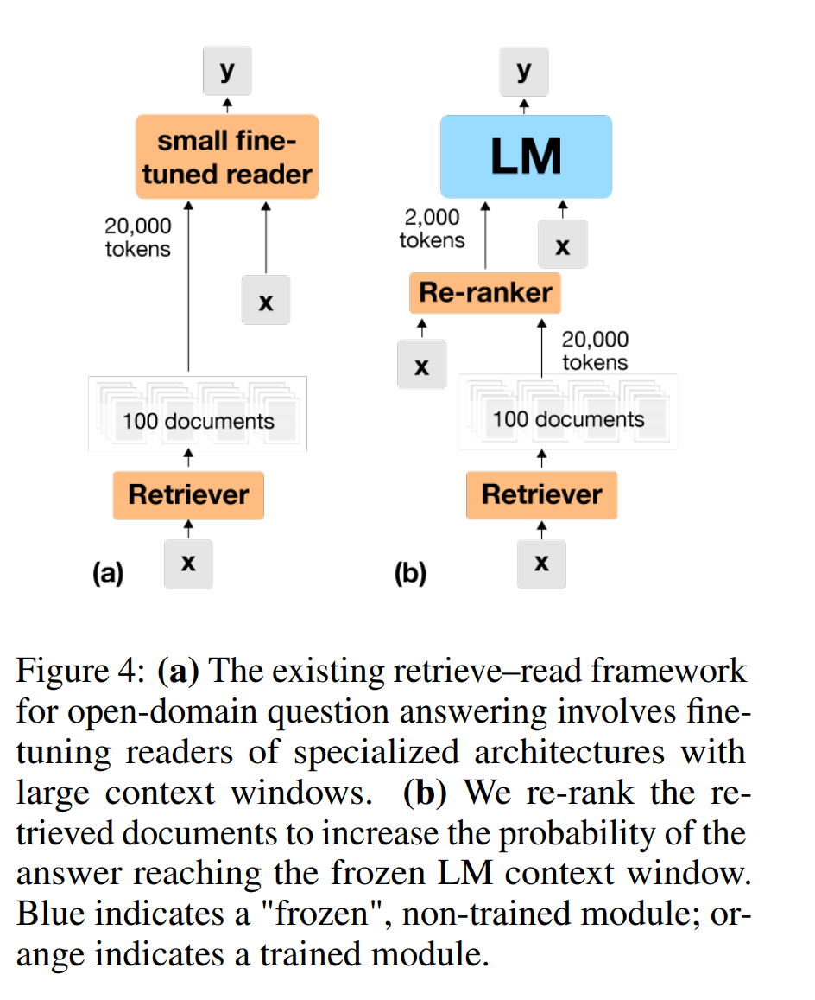
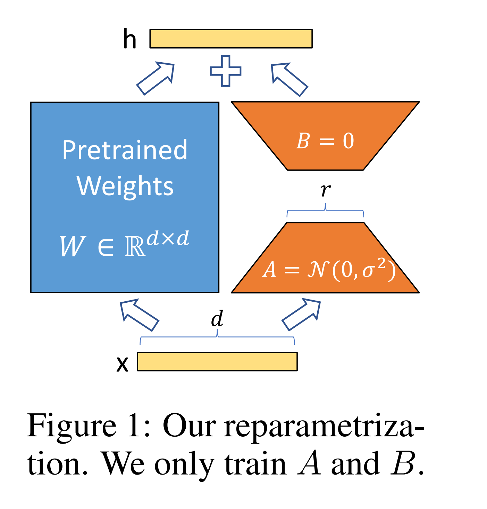
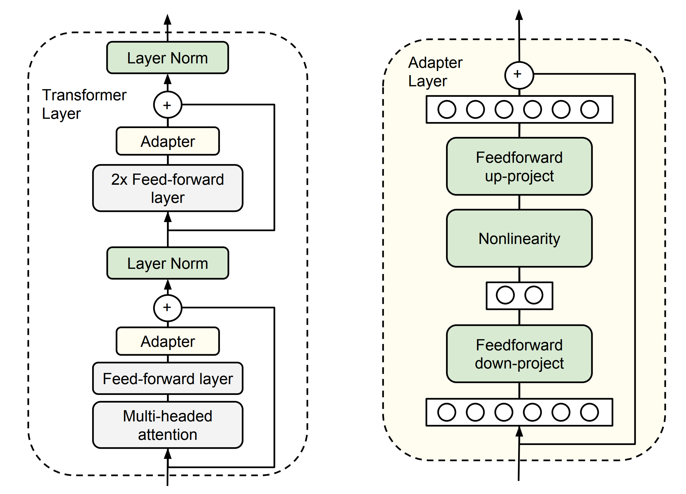
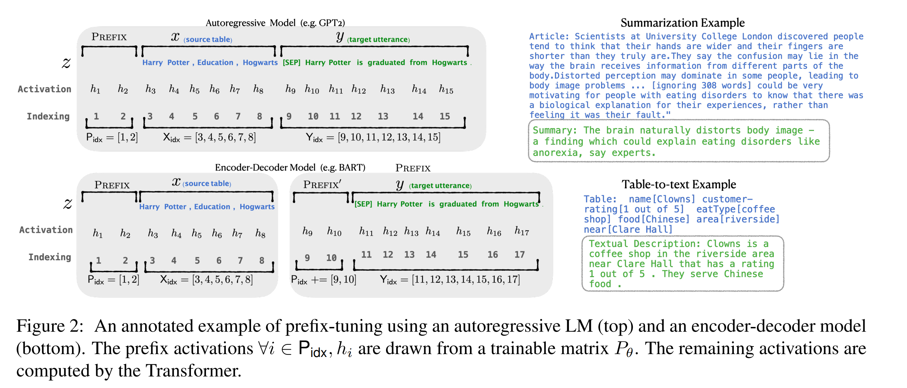
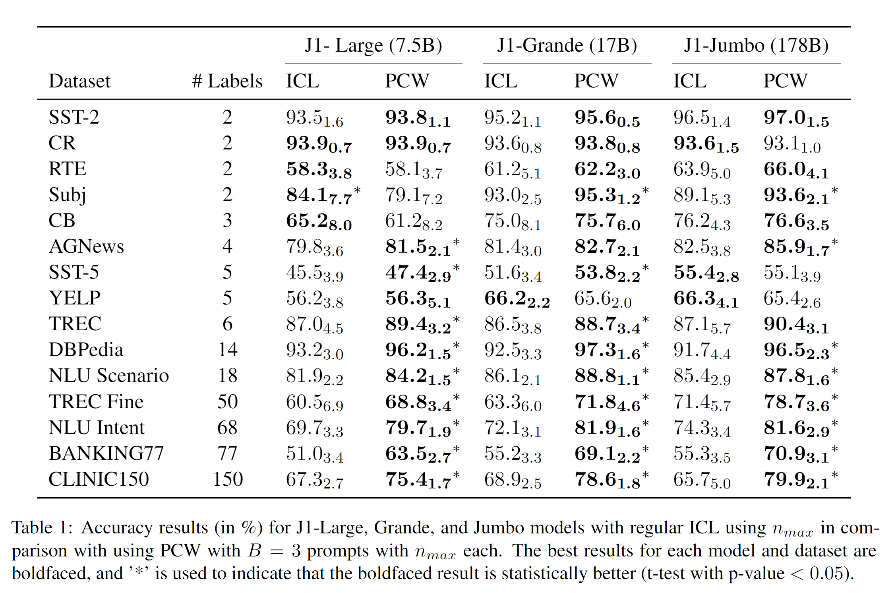

# 小模型&过去的方法
## Dense Passage Retrieval for Open-Domain Question Answering

双塔结构对Query和文章分别编码，实现了稠密向量用于检索

## Realm: Retrieval-Augmented Language Model Pre-Training

x->doc，编码计算相似度 or 拼接后进Bert
(x,doc)->y 任务可以是预训练，也可以是微调，阅读文档的方式是，输入和文档拼接后送入Encoder

##  RAG: Retrieval-Augmented Generation for Knowledge-Intensive NLP Tasks

## Leveraging Passage Retrieval with Generative Modelsfor Open Domain Question Answering

## Atlas: Few-shot Learning withRetrieval Augmented Language Models

探究了4种检索Loss，3种检索更新策略，4种语言模型预训练方式 对 语言模型在下游任务上few-shot能力的影响。但是没有探究模型结构的影响。当然继承了FID模型结构的Atlas效果要好于FID以及Retro。

## Retro: Improving language models by retrieving from trillions of tokens

## WebGPT: Browser-assisted question-answering with human feedback

通过4种方式让GPT可以学会检索文档

# 相关论文调研
## Why Does ChatGPT Fall Short in Answering Questions Faithfully?

没有模型结构上的创新，而是调研了ChatGPT在几个方面上的表现。

从中可以看出：
1. GPT-3.5、GPT-4的事实问答错误一般都在事实性问题上，规模变大对此的缓解较少。
2. 只要给定事实就可以避免这个问题。

LLM还是需要外部事实的。希望借助LLM本身的能力还是不够

## Shall We Pretrain Autoregressive Language Models with Retrieval? A Comprehensive Study

英伟达团队复现了(Retro)[https://github.com/NVIDIA/Megatron-LM/tree/main/tools/retro]（9.5B, 330Btoken），着重讨论未来的自回归语言模型是否需要检索。

通过对比Retro和 GPT&通过微调和在推断时刻检索增强的GPT：
1. 在文本生成方面，Retro表现更好，degeneration大幅下降，事实准确更高，在无毒性的检索数据库上毒性轻微降低。
2. 在知识密集型任务上明显表现更好，其他方面与GPT差不多
3. 提出Retro++，相比于Retro在开放域问答上表现更好（相比于原Retro EM score+8.6）。并且显著强于检索增强的GPT

在预训练或者微调时让模型学会使用检索到的信息好于直接给

## Generalization through Memorization: Nearest Neighbor Language Models

KNN-LM

如图所示，语言模型得到一个概率$P_{LM}(y)$，而检索部分得到一个概率，两个概率相加

## In-Context Retrieval-Augmented Language Models

检索的两种思路：
1. Nearest Neighbor Language Models，在推断的时候，LM提供一个概率，从检索语料中的找到的Embedding空间最近的几个单词提供一个概率，两个概率加起来。可以说LM推断和检索增强同时进行
2. Retrieve and Read Models，首先根据输入找到检索的文本（Retrieve），然后将检索到的文本加入到语言模型的推断过程中（Read）。

对于第二种思路，在第二部分，将检索到的信息融入到语言模型之中，也就是模型结构上的创新。对于检索部分的讨论，以何种方式检索（BM25，embedding），以多大的频率更新，以何种loss训练检索器，检索的频次，检索Query如何构造，这些暂时先不关心。当然在检索端对这些点做提高应该也可以 

In-context，直接将检索到的文本，与Query拼接，然后输入LM，超过最大长度就砍掉左边的。对于这个思路的优化方法，可以是优化检索过程，也就是eg.原来只用BM25给定的Top1，现在用BM25给定的前16个，然后实际测试选最好的。这只是为了证明有必要重排序，也就是最好的不一定是Top1。但这里作者想的重排序也只是为了找到最好的“那一个”

这篇文章的改进就在于重排序，重排序的方法。

假设LM输入长度是m，要预测后续的token，就要从BM25返回的前25个文档中选一个。选择方式是，基于选择的文档和输入的前m-n个token，语言模型返回后n个token的概率最大。如此完成了对BM25返回的文档的重排序。

评价：一个很好的方法，在LM输入上作文章，分为两部分，用前一部分加文档去预测后一部分，模拟了LM训练过程。是否可以基于此种思路做进一步的创新？不过这个方法貌似没有涉及到Incoporate，只涉及到了Retrive。这本质还是一种新的检索信号，只不过这个由于直接是用当前样本的输入，所以这个重排序过程甚至不需要训练，是Zero-Shot的Ranker。

如果实在想基于这一点创新，那么就是，用一个神经网络来建模这个重排序过程，或者说是重构。具体思路是：

给定选择出的K个文档，基于输入的前半部分和输入的后半部分，得到这些文本的权重，然后拿这些权重来融合K个文档，去用在真实的输入上输入LM，得到一个Loss。基于模型的前半部分和后半部分，得到一个文本的权重，这个语言模型可以是待增强的，也可以是一个小型的其他的LM，这个作者已经提到了。借助前面得到的Loss就可以对这个Ranker模型进行SFT。

这篇文章根本还是为了验证这种In-Context检索增强的方式，然后探索了一些检索文档的方法。一是拿LM做Zero-shot Ranker(就是上面的方法不微调)，第二种是微调的Ranker(就是在待增强的LM上得到一个Loss，作为LM Ranker的微调信号)

## Standing on the Shoulders of Giant Frozen Language Models
探索一些技巧使得Frozen LM可以达到Finetune LM的效果

1. prompt工程，Decoder-Only LM是可以接受向量作为输入的
    
    
    
    

2. 检索增强

    

3. 重复使用Forzen LM

    

    第一个是生成很多个候选，然后采样。第二个是隐状态。

## Decoupled Context Processing for Context Augmented Language Modeling

与Retro不同的点在于对context的编码不需要输入的介入，但是在模型结构上，利用检索文本的能力仍然需要通过训练来得到。

创新点在于对Passage的编码与输入独立了。这么做的好处是

## LoRA: Low-Rank Adaptation of Large Language Models
Lora：微调预训练模型时，可以不微调整个模型，而是微调模型（某几层）的旁路，可以说是将微调时的领域信息放到了旁路里面。

其他微调手段有一定的缺点：

Adapters引入额外的推理延迟 (由于增加了模型层数)eg. **Parameter-Efficient Transfer Learning for NLP**。(2019)为Bert加适配器，在GLUE数据集上做实验，与Finetune相比性能差距在4%内。相比于Finetune，其训练的参数量少很多，每个任务带来的适配器参数相当于Bert的3.6%

Prefix-Tuning难于训练，且预留给prompt/prefix的序列挤占了下游任务的输入序列空间，影响模型性能。**Prefix-Tuning: Optimizing Continuous Prompts for Generation**

The Power of Scale for Parameter-Efficient Prompt Tuning

是否可以训练一个模型，可以将检索到的文档，变成旁路中的参数。
第二种，对于一般的LLM，都可以为他们训练一个适配的旁路参数使得他们具备阅读检索文档的能力。

## Parallel Context Windows Improve In-Context Learning of Large Language Models
一个新的Idea，从根源上解决问题，扩大LLM的输入限制长度。

首先把输入的In context分为两部分：context token, task token。
比如对于检索增强任务而言，检索到的多个文档就是context token，任务输入就是task token.
对于few-shot一类的任务，给定的几个（x，y）的例子就是context token，最后要预测答案的x就是task token.

如图所示，下半部分就是PCW示例。左边三个input和包含答案的topic就是context token，右边就是task token。而context token和task token都是要送入LLM的输入。

实现PCW具体需要两个措施：

假设总输入长度是B*C+T，其中B*C是context token总长，一共有B个示例，每个示例长度是C。T是Task token总长。
上面是位置向量的设计，可以看到B个示例中相同位置下token的位置向量编码是一样的。

除位置向量外，还有注意力机制。对于这种Decoder-only的LLM，内部的注意力机制，一般如左图，从左到右，每个token能看到左边的。而对于PCW，在Context token中，每个token只能看到同一个window中左边的token。而task token可以看到左边全部window中的token。

结果

"# label"表示多分类问题，这里PCW都用了3倍于ICL的样例。多分类里面，类别越多，提高越大
